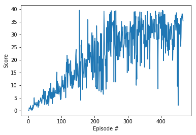

# Deep Reinforcement Learning Nanodegree - Project 2: Continuous Control

I've chosen to solve the first version of the environment (single agent). To do so, I've used the off-policy DDPG algorithm. The task is episodic,
and in order to solve the environment, the agent must get an average score of +30 over 100 consecutive episodes.


## Method: Deep Deterministic Policy Gradient (DDPG)
I've implemented an off-policy method called Deep Deterministic Policy Gradient and described in the paper .
Basically, the algorithm learns a Q-function using Bellman equation and off-policy data. After data, the Q-function is used to learn the policy.

The code consist of :

- model.py :the actor and critic classes implement a target and a neural network used. 
- agent.py: implement the agent and the learn() method updated the policy and value parameter. initialize the buffer and the target and local neural networks. Every 4 steps it updates the target network weights with the current weight values from the.
- Reacher_Project.ipynb: jupyter notebook that allows us to train the agent and plot the score results. 

### Neural Network
#### Actor

    Hidden: (input, 256) - ReLU
    Hidden: (256, 128) - ReLU
    Output: (128, 4) - TanH


#### Critic

    Hidden: (input, 256) - ReLU
    Hidden: (256 + action_size, 128) - Leaky ReLU
    Output: (128, 1) - Linear

### Hyperparameters
#### Agent
```
BUFFER_SIZE = int(1e5)  # replay buffer size
BATCH_SIZE = 128        # minibatch size
GAMMA = 0.99            # discount factor
TAU = 1e-3              # for soft update of target parameters
LR_ACTOR = 2e-4         # learning rate of the actor
LR_CRITIC = 2e-4        # learning rate of the critic
WEIGHT_DECAY = 0        # L2 weight decay
```
#### Train
```
n_episodes = 100        # maximum number of training episodes number of training episodes
max_Ds = 1000           # max step in each episode
```

### Plot of Rewards

The result is shown in the figure. The environment is solved in 466 episodes, average score of 30.01. 



## Improvement

- An evolution to this project would be to train the 20-agents version given by Udacity. However, in this case, another algorithm that use multiple copies of the same agent should be used, such as PPO, A3C and D4PG.
- The neural network could also be depper.
- The hyperparameters can be fine tuned.
- In addition, we could experiment with adding more elements to the neural networks, such as dropout layers. That is mentioned on 
- We could also implement Prioritized Experience Replay (see ). This prioritize the more important experiences (i.e. those experiences from which the network can learn the most) so the algorithm becomes more stable and the should obtain the score of 30 in less episodes.

## References
- Udacity's  from `finance/model.py`
- Udacity's  `from ddpg-bipedal/model.py`

